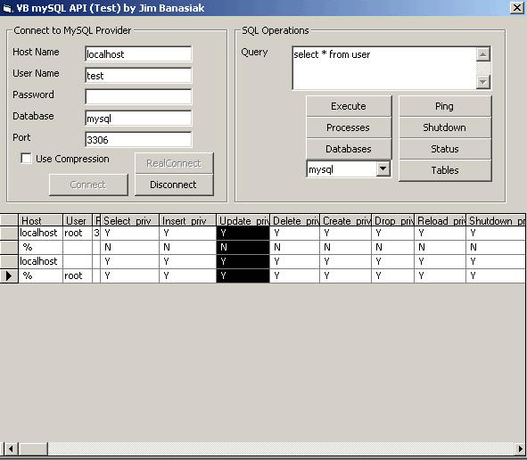



## VBMysqlAPI

### Description

VB mysql API is a wrapper around libmysql.dll to connect Visual Basic applications to mySQL databases. It comes with the translation of the API calls to libmysql.dll and a class wrapper to ease the implementation of mySQL into your application. Test with any mysql database.

Comes with class, lib, dll, and example program.

Planet source code times out on uploading, so please download at

http://www.macrometrics.com/dev
 
### More Info
 
http://www.macrometrics.com/dev

Possible memory leak has been brought to my attention. I am working on an Update for version .02 and a possible .NET translation if I have time.

d/l http://www.macrometrics.com/dev

             |
---                |---
**Submitted On**   |2001-04-17 01:04:16
**By**             |[Jimbo](https://github.com/Planet-Source-Code/PSCIndex/blob/master/ByAuthor/jimbo.md)
**Level**          |Advanced
**User Rating**    |5.0 (10 globes from 2 users)
**Compatibility**  |VB 6\.0
**Category**       |[Complete Applications](https://github.com/Planet-Source-Code/PSCIndex/blob/master/ByCategory/complete-applications__1-27.md)
**World**          |[Visual Basic](https://github.com/Planet-Source-Code/PSCIndex/blob/master/ByWorld/visual-basic.md)
**Archive File**   |[VBMysqlAPI16597110172003\.zip](https://github.com/Planet-Source-Code/jimbo-vbmysqlapi__1-48230/archive/master.zip)

### API Declarations

http://www.macrometrics.com/dev

